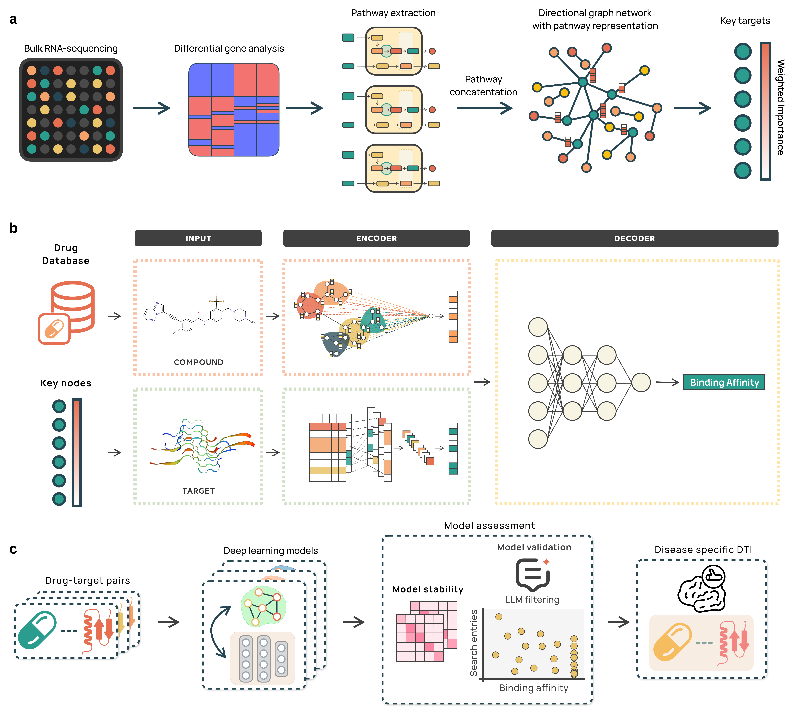
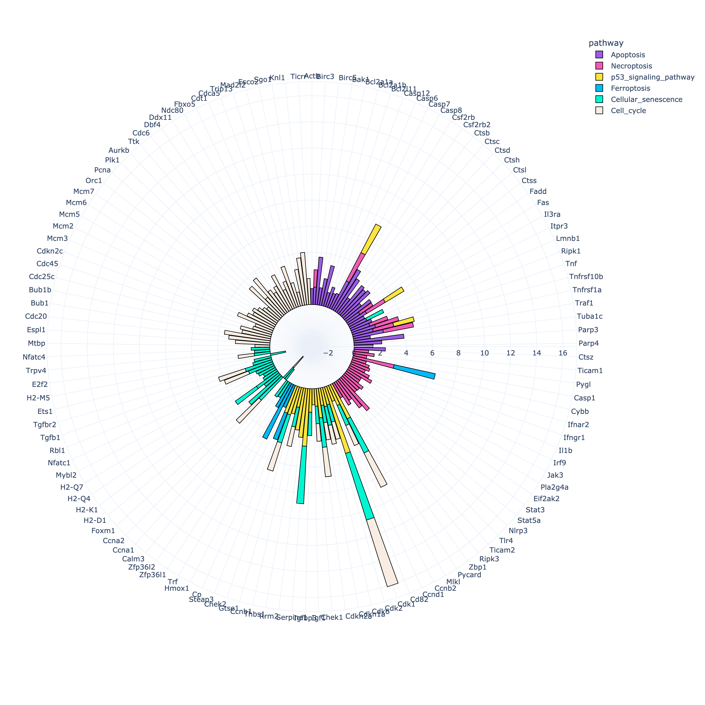
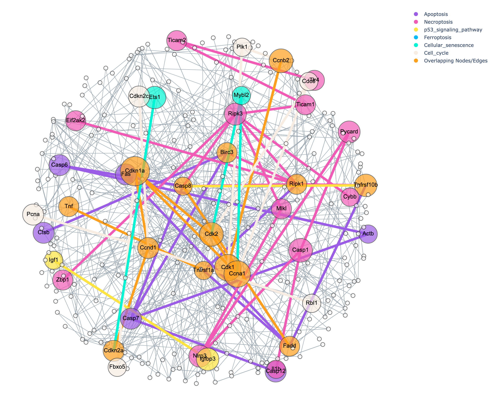

# strokeDTI

Official implementation of **strokeDTI**, a tool designed for graph-based analysis of RNA-seq data and prediction of drug-target interactions.

Originally validated on stroke RNA-seq data with a focus on cell death pathways, **strokeDTI** can, in theory, be applied for other KEGG pathways with shared genes.



---

## Table of Contents

1. [Installation](#installation)
2. [Usage](#usage)
   - [Target Identification Module](#1-target-identification-module)
   - [DTI Prediction](#2-dti-prediction)
3. [Cite Us](#cite-us)
4. [References](#references)

---

# Installation

To set up the environment, use the following commands:

```
git clone https://github.com/Moonscape/strokeDTI.git

cd strokeDTI

conda env create -f environment.yml

```

To remove the conda environment and the package

```
conda activate stroke_dti

pip uninstall strokeDTI

conda deactivate

conda env remove -n stroke_dti
```

# Usage

**strokeDTI** consists of different modules, which can be used independently.

## 1. Target Identification Module

### Input:

1. **Deseq2 Data**: Processed RNA-seq data in `.tabular` format. The file must include the following headers:

   | GeneID | Base mean | log2(FC) | StdErr | Wald-Stats | P-value | P-adj | Chromosome | Start | End | Strand | Feature | Gene name |

   Example RNA-seq data was obtained from public repositories: [GSE137482](https://www.ncbi.nlm.nih.gov/geo/query/acc.cgi?acc=GSE137482)[1].

2. **KEGG Pathways**: A `.txt` file with terms separated by commas.
   - KEGG pathways can be obtained from the official [KEGG website](https://www.genome.jp/kegg/pathway.html).
   - Example file: `strokeDTI/data/kegg.txt`.

### Usage Example

To run the Target Identification module, follow these steps:

```
conda activate stroke_dti

identify_targets -s mouse -rna_seq data/galaxy_mouse.tabular -kegg data/kegg.txt -out output/

```

### Output

1. CSV files of the kegg terms merged with Deseq2 data
2. Merged network graph 1
   

3. Merged network graph 2
   

4. CSV files of node importance:

- degree centrality
- closeness centrality
- betweenness centrality
- eigenvector centrality
- k_shell

## 2. DTI prediction

After identifying potential targets in the first module, you can predict drug-target interactions using our pretrained model, which supports five different architectures. This model accepts drug structures in SMILES format and protein sequences as amino acid sequences, aligning with many established frameworks.

### Data Sources

- **SMILES:** Retrieve drug SMILES strings from the [ZINC database](https://zinc.docking.org/).
- **Amino Acid Sequences:** Obtain protein sequences from [UniProt](https://www.uniprot.org/).

### Inputs

1. **Drug List**

   - **File:** `drug_list.csv`
   - **Format:** CSV with the following headers:
     ```
     drug_names,drug_smiles
     ```

2. **Target List**
   - **File:** `target_list.pickle`
   - **Format:** A dictionary mapping protein names to their amino acid sequences.
   - **Example:** Refer to `data/sequence_dic.json` for a sample structure.

### Usage Example

To run the DTI prediction module, follow these steps:

```
conda activate stroke_dti

compute_dti \
--drug_csv data/drug_list_with_smiles_first_20.csv \
--sequence_json data/sequence_dic.json \
--output_dir output/
```

## Cite us:

If you use StrokeDTI in your research, please cite our work:

```

Peng, Jing-Jie, et al. “Hybrid Approach for Drug-Target Interaction Predictions in Ischemic Stroke Models.” Artificial Intelligence in Medicine, vol. 161, 2025, p. 103067, https://doi.org/10.1016/j.artmed.2025.103067.

```

## References

[1] Androvic P, Kirdajova D, Tureckova J, Zucha D, Rohlova E, Abaffy P, et al. Decoding the Transcriptional Response to Ischemic Stroke in Young and Aged Mouse Brain. Cell Rep. 2020;31:107777.
